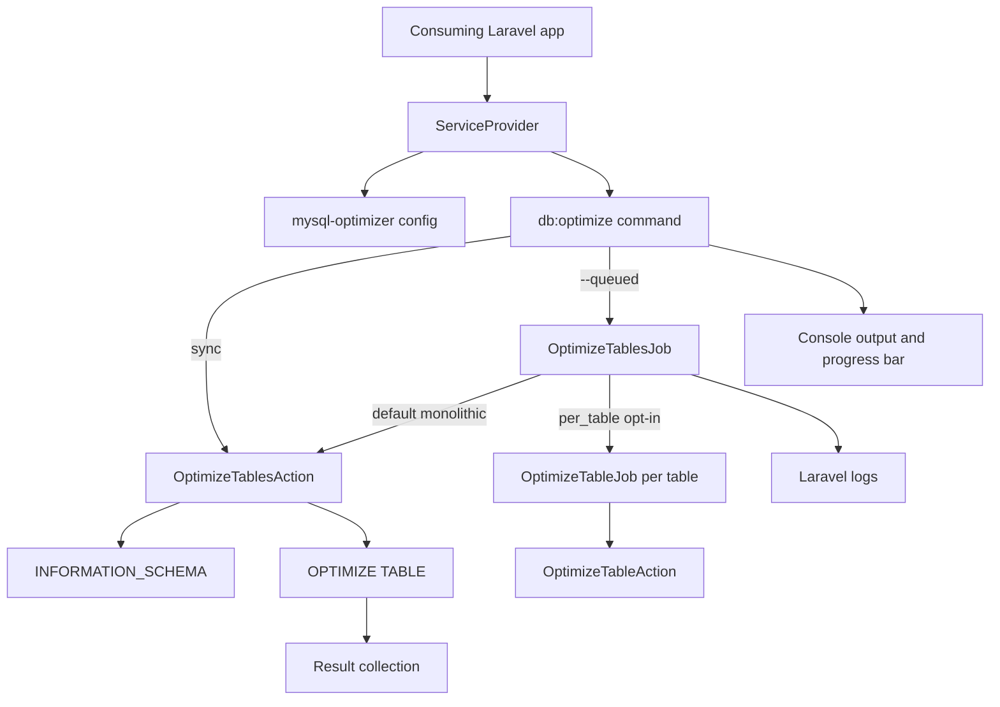

# Project Overview

`gigerit/laravel-mysql-optimizer` is Laravel library package. It adds
`db:optimize` Artisan command plus queueable job for MySQL/MariaDB
`OPTIMIZE TABLE` on all or selected tables. No full Laravel app here.

## Repository Structure

- `.cursor/` repo Cursor rules for package, DB tests, commands, perf, MySQL.
- `.github/` GitHub Actions CI plus Dependabot.
- `config/` publishable `mysql-optimizer.php`.
- `src/` package code under `MySQLOptimizer\`: provider, command, action, job,
  exceptions.
- `tests/` Pest suites: Unit, Feature, Integration; Orchestra Testbench boot.
- `CHANGELOG.md` Release Please history.
- `README.md` install, config, CLI, jobs, scheduling, ops, tests, compat.
- `composer.json` metadata, deps, autoload, scripts, Laravel discovery.
- `phpunit.xml` suites plus default test env.

## Build & Development Commands

Install deps:

```bash
composer install
```

Install package in consuming Laravel app:

```bash
composer require gigerit/laravel-mysql-optimizer
```

Publish config in consuming app:

```bash
php artisan vendor:publish --provider="MySQLOptimizer\ServiceProvider"
```

Run Unit + Feature:

```bash
composer test
```

Run Integration:

```bash
composer test:integration
```

Run Redis queue integration (requires disposable Redis and opt-in env):

```bash
REDIS_INTEGRATION=1 REDIS_HOST=127.0.0.1 REDIS_PORT=6379 \
composer test:redis-integration
```

Run all tests:

```bash
composer test:all
```

Run PHPStan:

```bash
composer test:types
```

Run Pint:

```bash
composer lint
```

Run package command in consuming app:

```bash
php artisan db:optimize [--database=default] [--table=*] [--queued] [--no-log]
```

Run queue worker for queued optimization:

```bash
php artisan queue:work
```

Inspect command:

```bash
php artisan db:optimize --help
```

Run local MySQL integration:

```bash
MYSQL_HOST=127.0.0.1 MYSQL_PORT=3306 MYSQL_DATABASE=testing \
MYSQL_USERNAME=root MYSQL_PASSWORD=password composer test:integration
```

CI Unit + Feature command, PHP 8.2/8.3/8.4/8.5:

```bash
vendor/bin/pest --testsuite Unit,Feature --colors=always
```

CI Integration command, PHP 8.4 + MySQL 8.0:

```bash
vendor/bin/pest --testsuite Integration --colors=always
```

> TODO: No local deploy command. `.github/workflows/CI.yml` uses Release
> Please on push to `main`.

## Code Style & Conventions

- PSR-4: `MySQLOptimizer\` -> `src`; `Tests\` -> `tests`.
- PSR-12 via Laravel Pint: `composer lint`.
- Pest tests. Feature extends `Tests\TestCase`; Integration extends
  `Tests\Integration\IntegrationTestCase`.
- Laravel-native package code. Prefer provider, container, console, queue,
  config, facade, Testbench patterns.
- Keep Laravel 8-13 support from `composer.json` unless user asks change.
- Keep sync and queued paths working together.
- Avoid new deps unless needed. Cursor rules prefer simple, small dep surface.
- LF endings. `.gitattributes` sets PHP/JSON/YAML/Markdown text, PHP LF.
- `composer.lock` ignored and generated; do not add unless policy changes.
- `vendor/` ignored; never edit it.
- > TODO: No commit message template found.

## Architecture Notes



`ServiceProvider` registers `db:optimize`, publishes
`config/mysql-optimizer.php` in Laravel console context, merges package config.
Config has `database`, default `env('DB_DATABASE')`, plus queue routing,
runtime, uniqueness, and opt-in per-table settings.

`src/Console/Commands/Command.php` is CLI edge. Reads `--database`, repeatable
`--table`, `--queued`, `--no-log`. Sync path counts tables, shows progress,
runs `OptimizeTablesAction`, prints success count. Queued path dispatches
`OptimizeTablesJob`.

`src/Actions/OptimizeTablesAction.php` preserves synchronous and default
monolithic queued flow. Target resolution canonicalizes database/table names
through `INFORMATION_SCHEMA`; single-table execution qualifies and quotes both
schema and table. Results contain `table`, `success`, `timestamp`.

`src/Jobs/OptimizeTablesJob.php` implements `ShouldQueue` and
`ShouldBeUnique`. Queue defaults are `tries = 1`, `timeout = 3600`,
`uniqueFor = 0`, `backoff = 3600`; published config can override runtime and
routing. Default mode remains one sequential monolithic job. Opt-in
`queue.per_table` fans out unique `OptimizeTableJob` children and requires an
explicit dedicated connection and queue intended for one worker.

Queued execution validates inspectable queue reservation settings before
command dispatch and again against the actual reserved connection before DDL.
`backoff` does not extend Redis `retry_after`; require job timeout plus the
package safety margin to fit below `retry_after`. Horizon also needs its
supervisor timeout between job timeout and `retry_after`.

Package narrow: no migrations, schemas, models, controllers, routes, views, or
HTTP API.

## Testing Strategy

- Unit: job metadata, exceptions.
- Feature: config, provider, command, action, queue dispatch via Testbench and
  Mockery.
- Integration: real MySQL plus temp `test_users` and `test_posts`, exercising
  `INFORMATION_SCHEMA` and `OPTIMIZE TABLE`.
- `phpunit.xml`: `APP_ENV=testing`, SQLite `:memory:`, sync queue by default.
  Integration overrides DB to MySQL.
- CI: Unit + Feature on PHP 8.2, 8.3, 8.4, 8.5.
- CI: Integration on PHP 8.4 with MySQL 8.0.
- CI: Redis integration on PHP 8.4 with Redis 7 and three real concurrent
  Laravel workers. The suite must fail, not skip, when `REDIS_INTEGRATION=1`
  and Redis/PhpRedis/PCNTL is unavailable.
- SQL/command/provider/queue changes need targeted suite; run
  `composer test:all` when practical.
- Never use DB refresh traits or destructive helpers on real DB without
  explicit user approval.

## Security & Compliance

- Target DB comes from `mysql-optimizer.database`, default `DB_DATABASE`.
  Never commit real `.env` or creds.
- Integration env: `MYSQL_HOST`, `MYSQL_PORT`, `MYSQL_DATABASE`,
  `MYSQL_USERNAME`, `MYSQL_PASSWORD`.
- CI release auth uses `secrets.GITHUB_TOKEN`.
- Dependabot checks Composer and GitHub Actions weekly.
- Run dependency audit when deps change:

```bash
composer audit
```

- `OPTIMIZE TABLE` can lock tables and needs DB privileges. Keep low-traffic
  window guidance.
- Validate DB/table names through structured DB queries before optimize.
- License declared MIT in `composer.json` and `README.md`.
- > TODO: No `LICENSE`, `CONTRIBUTING.md`, or `CODE_OF_CONDUCT.md` file,
  though `README.md` links contribution and conduct docs.

## Agent Guardrails

- gigerIT dependency rule: if task blocked by bug/gap in dependency owned by
  `gigerit` (`gigerit/*`, `@gigerit/*`, or provider/creator/author starts
  with `gigerit`), do not workaround in consuming project. Stop task. Report
  package, version, blocker, expected/actual, repro/code path, suggested fix.
  Continue only after dependency fixed or user explicitly asks workaround.
- Do not edit `vendor/`, generated dependency code, or ignored IDE state.
- Do not add `composer.lock` unless user changes package policy.
- Do not truncate tables, refresh migrations, wipe DBs, or run destructive DB
  commands without explicit user approval.
- Do not test against production/shared DB. Integration needs disposable test
  tables and cleanup.
- Treat `OPTIMIZE TABLE` as operationally sensitive; it may lock tables.
- Do not treat `$backoff`, `$tries`, or `ShouldBeUnique` as protection against
  Redis reservation expiry. Validate `retry_after`, and keep per-table mode on
  an explicit dedicated one-worker queue.
- Keep Laravel/PHP support in sync with CI and `composer.json`.
- SQL/table/DB validation changes need injection review and input tests.
- Preserve sync + queued public API unless user asks breaking change.
- Do not create nested `AGENTS.md` unless asked. For narrow workflow guidance,
  prefer scoped skill under `./.agents/skills`.

## Extensibility Hooks

- Laravel auto-discovers `MySQLOptimizer\ServiceProvider` from `composer.json`
  `extra.laravel.providers`.
- Consumers can publish/override `config/mysql-optimizer.php`.
- `mysql-optimizer.database` controls default DB, falling back to `DB_DATABASE`.
- `db:optimize` supports DB select, table select, queueing, no-log.
- `OptimizeTablesJob` can dispatch directly, `onQueue`, delay, disable logging.
- Consumers can schedule job or command through Laravel scheduler.
- Queue behavior comes from consuming app queue connection and workers.
- `mysql-optimizer.queue.per_table` opts into per-table fan-out; it defaults to
  `false` and requires explicit queue connection and name.

## Further Reading

- [`README.md`](README.md) install, usage, scheduling, ops.
- [`CHANGELOG.md`](CHANGELOG.md) release history.
- [`composer.json`](composer.json) deps, scripts, autoload, discovery.
- [`phpunit.xml`](phpunit.xml) suites, default test env.
- [`.github/workflows/CI.yml`](.github/workflows/CI.yml) CI and release.
- [`.github/dependabot.yml`](.github/dependabot.yml) dependency updates.
- [`.cursor/rules/laravel-package-development.mdc`](.cursor/rules/laravel-package-development.mdc)
  package guidance.
- [`.cursor/rules/mysql-optimization.mdc`](.cursor/rules/mysql-optimization.mdc)
  MySQL optimization guidance.
- [`.cursor/rules/database-testing.mdc`](.cursor/rules/database-testing.mdc)
  DB test safety.
- > TODO: Add `LICENSE`, `CONTRIBUTING.md`, `CODE_OF_CONDUCT.md`, or remove
  README links if absent by choice.
